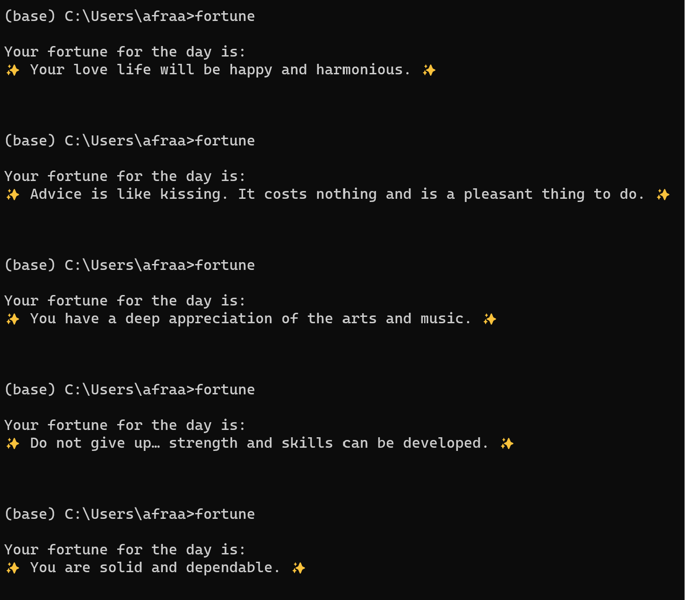

# Fortune Cookie Packaging

[](https://github.com/nogibjj/Fortune-Cookie-Generator-Python-Package/actions/workflows/main.yml)
Authors: Simrun Sharma & Afraa Noureen 

***

## Purpose

Fortune Cookie Packaging is a Python command-line tool that packages a collection of 1000 different fortunes into an easily accessible format. This tool was developed as part of a collaborative project by *Afraa* and *Simrun*. The dataset includes fortunes gathered from various sources, including the internet, handwritten notes, and contributions from our cohort. This README provides an overview of the tool, including installation instructions and usage guidelines.

***

## Installation

Upon modifying the import statements as specified in the comments of main.py, the repo was packaged and published to Pypi. The install command for this package can be found [here](https://pypi.org/project/fortune-cookie-generator-demo/0.0.14/).

Alternatively, run this on your command line:
```
# To install the package
pip install fortune-cookie-generator-demo==0.0.14
```

***

## Usage

Once the tool is installed, you can use it from the command line as follows:

```
fortune
```

This command will display a random fortune from the dataset.

***

## Functionality

This Fortune Cookie Packaging tool offers the following functionality:

1. Random Fortune Display: Users can view a random fortune from the dataset by running the fortune-cookie command.
2. Packaging: The tool packages the collection of fortunes into an easily accessible format, allowing users to receive inspiring and humorous messages with a simple command. The tool provides a seamless experience for users, delivering random fortunes with each execution. The functionality is robust and reliable.
3. Database Integration: This tool does not require communication with an external or internal database. It operates solely based on the packaged dataset of 1000+ fortunes.

***

## Interesting Concept
From the 1000+ fortunes we have created an encrypted database so that none of the fortunes are accesible to the general public and essentially hiding the fortune. It is a "packaged" version of the concept of hidden fortunes in the cookie. Our tool then decrypts the fortune from the queried fortune in the encrypted database. These are randomly generated fortunes associated with a random number in the encrypted database. 


## Result

On running the `fortune` command in the command line you get:


